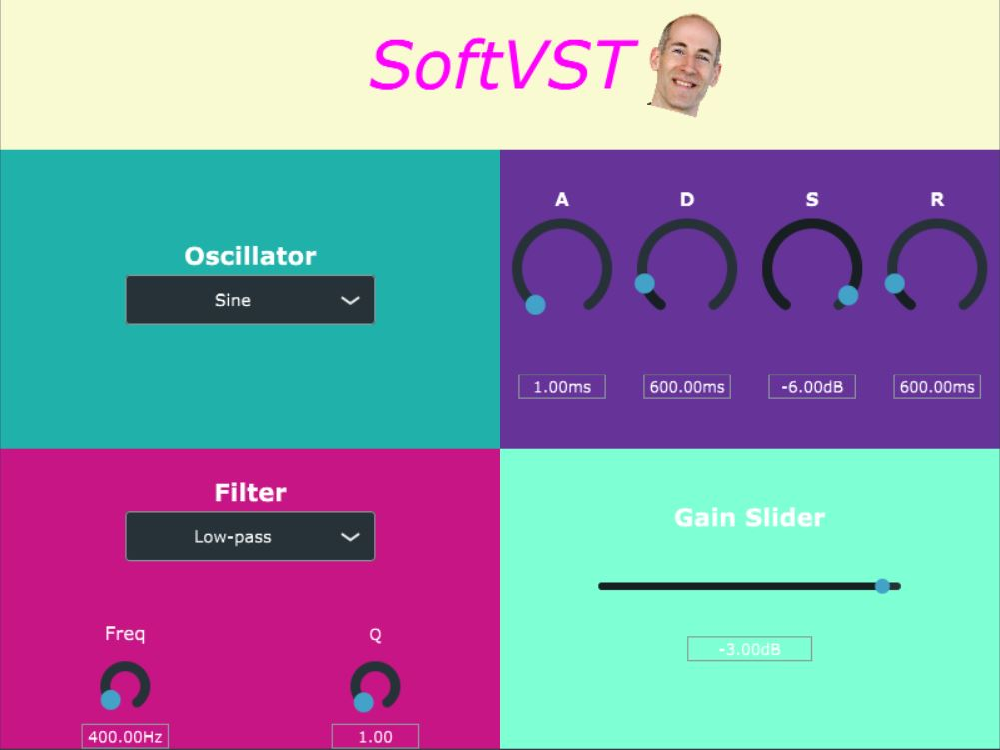

# SoftVST Report

Team SoftVST: Sparsh Bansal, Richard Gao

_Start Date: Week of Feb 18th_

_End Date: Report due April 4th_

## Project Goal

The goal of the project was to take a dive into creating audio plugins and learning DSP. To do this we decided to create a  (Virtual Studio Technology) with a GUI in C++. We decided the lower bound of the project to be a synthesizer that produces a standard waveform (sine, square, saw, etc.) with a few tunable parameters. The audio plugin should also be able to integrate into a standard DAW (digital audio workstation). The stretch goal we had in mind given time was to start looking into building effects such as delay and distortion.  

## Learning Goals

Our learning goal was to acquire more familiarity with C concepts and learn C++ by working on a real world project that interests us: developing music software. We also wanted to learn the basics of audio programming, especially understanding what goes into building synthesizers and common effects. 

## Resources Used

We found the Youtube channel [The Audio Programmer](https://www.youtube.com/channel/UCpKb02FsH4WH4X_2xhIoJ1A) and the online JUCE documentation to be very helpful when implementing our project.

In terms of the theory, we found the books *Designing Audio Effect Plugins in C++ by Will C. Pirkle* and *The Audio Programming Book by Richard Boulanger and Victor Lazzarini*. to be very helpful. We used these books to learn the digital signal processing that goes into audio effects and general audio handling. 

In terms of technologies we used the [JUCE framework](https://juce.com/) for building the audio application and the [Maximilian](https://github.com/micknoise/Maximilian) library that provides common auido and music DSP functions in C++.

## Accomplishments



We have created a VST plugin that is able to be directly integrate with any DAW that supports VST3 audio plugins. SoftVST is a software synthesizer. It takes in midi commands from a midi controller or your keyboard and through a dropdown menu, allows you to start building your sound with a choice of the following waveforms: sine, saw, square, phasor, triangle, noise. There is also an ADSR (attack, decay, sustain, release) envelope and a dropdown choice between a low-pass, high-pass, and band-pass filter to help shape your sound. The waveform is then routed to the gain slider where the final sound is able to be mixed into your project/session. We felt that with these functions, using sound design techniques, a lot of the common plucks, pads, etc. sounds can be built.

The overall architecture of the application consists of an editor, processor, synth voices, oscillator, envelope, filter, and gain slider:

### PluginEditor
For all audio plugins built in the JUCE framework, the `PluginEditor` class handles the frontend GUI. This is where you initialize the GUI elements and paint them on the canvas. The common JUCE workflow is to have the `PluginEditor` be the "frontend" handling the display and events and passing information over to `PluginProcessor`, the "backend", to be processed.

Here we initialize the GUI elements:

```c++
SoftVstAudioProcessorEditor::SoftVstAudioProcessorEditor (SoftVstAudioProcessor& p)
    : AudioProcessorEditor (&p), processor (p), envGUI(p), oscGUI(p), filterGUI(p), gainGUI(p)
{
    setSize(800, 600);

	// Add Title
	title.setFont(Font("Verdana", 64.0f, Font::italic));
	title.setColour(Label::textColourId, Colours::fuchsia);
	title.setText("SoftVST", dontSendNotification);
	title.setJustificationType(Justification::centred);
	addAndMakeVisible(title);

	// Add UI Elements
	addAndMakeVisible(oscGUI);
	addAndMakeVisible(envGUI);
	addAndMakeVisible(filterGUI);
	addAndMakeVisible(gainGUI);

	allen = ImageFileFormat::loadFrom(BinaryData::allen_png, BinaryData::allen_pngSize);
}
```

We arrange the elements and place them on the GUI window:

```c++
void SoftVstAudioProcessorEditor::resized()
{	
	// Title gui placement
	juce::Rectangle<int> area = getLocalBounds();
	int headerHeight = 100;
	title.setBounds(area.removeFromTop(headerHeight));

	// Componenets gui placement 
	Grid grid;
	using Track = Grid::TrackInfo;

	grid.templateRows = { Track(1_fr), Track(2_fr), Track(2_fr) };
	grid.templateColumns = { Track(1_fr), Track(1_fr) };
	grid.items = { nullptr, nullptr, GridItem(oscGUI), GridItem(envGUI), GridItem(filterGUI), GridItem(gainGUI) };
	grid.performLayout(getLocalBounds());
}
```

### PluginProcessor

The `PluginProcessor` is where most of the heavy DSP code is usually placed. In our case, we were building a synth so the responsibility for the sound processing is passed onto `SynthVoice`. However, we still use the `PluginProcessor` class to first setup the synth and then to capture the values of the GUI elements that are important in shaping the sound, relaying this to `SynthVoice`.

Here we setup the synth by clearing the buffer and adding a number of voices for our synth:

```c++
SoftVstAudioProcessor::SoftVstAudioProcessor()
#ifndef JucePlugin_PreferredChannelConfigurations
     : AudioProcessor (BusesProperties()
                     #if ! JucePlugin_IsMidiEffect
                      #if ! JucePlugin_IsSynth
                       .withInput  ("Input",  AudioChannelSet::stereo(), true)
                      #endif
                       .withOutput ("Output", AudioChannelSet::stereo(), true)
                     #endif
                       ), apvts(*this, nullptr, "Parameters", createParameters())
#endif
{
	synth.clearVoices();

	// Polyphonic synthesiser with 5 voices
	for (int i = 0; i < 5; i++)
	{
		synth.addVoice(new SynthVoice());
	}

	synth.clearSounds();
	synth.addSound(new SynthSound());

}
```
We grab all the values from each slider, dropdown, etc. and call the appropriate setter function in `SynthVoice` to build out the wave:

```c++
void SoftVstAudioProcessor::processBlock (AudioBuffer<float>& buffer, MidiBuffer& midiMessages)
{
	// Walkthrough each synth voice and build sound
	for (int i = 0; i < synth.getNumVoices(); i++)
	{
		if ((synthVoice = dynamic_cast<SynthVoice*>(synth.getVoice(i))))
		{
			float* osc = (float*)apvts.getRawParameterValue(OSC_ID);
			synthVoice->setOscType(osc);

			float* attack = (float*)apvts.getRawParameterValue(ATTACK_ID);
			float* decay = (float*)apvts.getRawParameterValue(DECAY_ID);
			float* sustain = (float*)apvts.getRawParameterValue(SUSTAIN_ID);
			float* release = (float*)apvts.getRawParameterValue(RELEASE_ID);
			synthVoice->setADSR(attack, decay, sustain, release);

			float* filter = (float*)apvts.getRawParameterValue(FILTER_ID);
			float* freq = (float*)apvts.getRawParameterValue(FREQ_ID);
			float* res = (float*)apvts.getRawParameterValue(RES_ID);
			synthVoice->setFilter(filter, freq, res);

			float* gain = (float*)apvts.getRawParameterValue(GAIN_ID);
			synthVoice->setGain(gain);
		}
	}


	buffer.clear();

	synth.renderNextBlock(buffer, midiMessages, 0, buffer.getNumSamples());
}
```

### SynthVoice

The `SynthVoice` processes and "synthesizes" the waveform. In this class, all the tunable parameters from the frontend that gets passed along are used to generate the sound. It is also here that we define what is expected on a midi key press and key release.

Here is an example of a getter/setter that is in `SynthVoice`. The setter is used previously in the `PluginProcessor` class to pass the wave type to use. Then in the `getSound()` function, `getOscType()` along with a couple other getters are used to construct the wave:

```c++
void setOscType(float* type)
{
  wave = *type;
}

double getOscType()
{
  switch (wave)
  {
    case 0:
      return osc1.sinewave(frequency);
    case 1:
      return osc1.saw(frequency);
    case 2:
      return osc1.square(frequency);
    case 3:
      return osc1.phasor(frequency);
    case 4:
      return osc1.triangle(frequency);
    case 5:
      return osc1.noise();
    default:
      // TODO: throw exception if none of the waves are selected
      return osc1.sinewave(frequency);
  }
}
```
The core of the synthesis is here in `renderNextBlock`. Each sample of the wave is generated for each channel. When put together these samples are what describes the sound.

```c++
void renderNextBlock(AudioBuffer<float>& outputBuffer, int startSample, int numSamples)
{
  // Walkthrough each audio sample
  for (int sample = 0; sample < numSamples; sample++)
  {
    // Walkthrough each channel, for stereo systems this is 2
    for (int channel = 0; channel < outputBuffer.getNumChannels(); channel++)
    {
      outputBuffer.addSample(channel, startSample, getSound() * Decibels::decibelsToGain(gain));
    }

    startSample++;
  }
}
```

### Components (Oscillator, Envelope, Filter, Gain)

For each of the frontend elements (the four main quadrants), we decided to encapsulate into an individual class. This design decision was made as the modular structure allowed the core `PluginEditor` and `PluginProcessor` to be simple and clean. Initially, the components were declared and handled in the above two mentioned classes. However, when the project got sufficiently large it slowly became more of a mess to handle. By breaking the classes up into smaller components, the code was then more readable and managable. Later down the line, this architucture proved its worth by making the arrangement of the GUI elements easier as we could just import and include smaller GUIs (`oscGUI`, `envGUI`, `filterGUI`, `gainGUI`) into the main Editor GUI. 

Each component (in this code snippet, the filter component) is responsible for setting up the GUI elements within itself:

```c++
Filter::Filter(SoftVstAudioProcessor& p) : processor(p)
{
	setSize(400, 400);

	// Configure combobox settings
	filterMenu.addItem("Low-pass", 1);
	filterMenu.addItem("High-pass", 2);
	filterMenu.addItem("Band-pass", 3);
	filterMenu.setJustificationType(Justification::centred);
	addAndMakeVisible(filterMenu);

	// Configure slider settings
	freqSlider.setSliderStyle(Slider::SliderStyle::Rotary);
	freqSlider.setRange(20.0f, 10000.0f);
	freqSlider.setValue(400.0f);
	freqSlider.setTextBoxStyle(Slider::TextBoxBelow, true, 70, 20);
	freqSlider.setTextValueSuffix("Hz");
	freqSlider.setSkewFactorFromMidPoint(1000.0);
	addAndMakeVisible(freqSlider);

    ...
	
	// Filter label settings
	filterLabel.setFont(Font(24.0f, Font::bold));
	filterLabel.setText("Filter", dontSendNotification);
	filterLabel.attachToComponent(&filterMenu, false);
	filterLabel.setJustificationType(Justification::centred);
	addAndMakeVisible(filterLabel);

    ...

	// Setup apvts attachments
	filterMenuAttachment =
		std::make_unique<AudioProcessorValueTreeState::ComboBoxAttachment>(processor.apvts,
			FILTER_ID, filterMenu);
    ...
}
```

And arranging the elements into its own smaller GUI square:

```c++
void Filter::resized()
{
	juce::Rectangle<int> area = getLocalBounds().reduced(100);
	// Move filterMenu up slightly
	area.setY(area.getY() - 50);
	filterMenu.setBounds(area);

	Grid grid;
	using Track = Grid::TrackInfo;

	grid.templateRows = { Track(2_fr), Track(1_fr) };
	grid.templateColumns = { Track(1_fr), Track(1_fr) };
	grid.items = { nullptr, nullptr, GridItem(freqSlider), GridItem(resSlider) };
	grid.performLayout(getLocalBounds());
}
```

## Reflection

Now at the end of the project, we are happy with the progress that we have completed. The project ended up in between the lower and upper bounds as we have completed everything we set out to achieve, only falling short of implementing effects (we got through reading some of the DSP concepts that goes into a Delay effect, but never got to integrate it the code into our project).

We have gained familiarity with C++ and even have a project to show for it. We learned how to quickly adopt new syntax and object oriented concepts, as well as using existing frameworks and libraries. Additionally, we also have experience with tools required to work remotely such as Visual Studio Live Share. We are happy to say our learning goals have been met.

### Extra Reflection

One takeaway that we made through this project experience is that the Visual Studio IDE, however powerful, is sometimes frustrating and confusing to use due to the need to have to wrestle with solution and build configurations. It is helpful that we now have some experience working in this IDE, but it was at times painful to debug why our application wasn't building properly.

